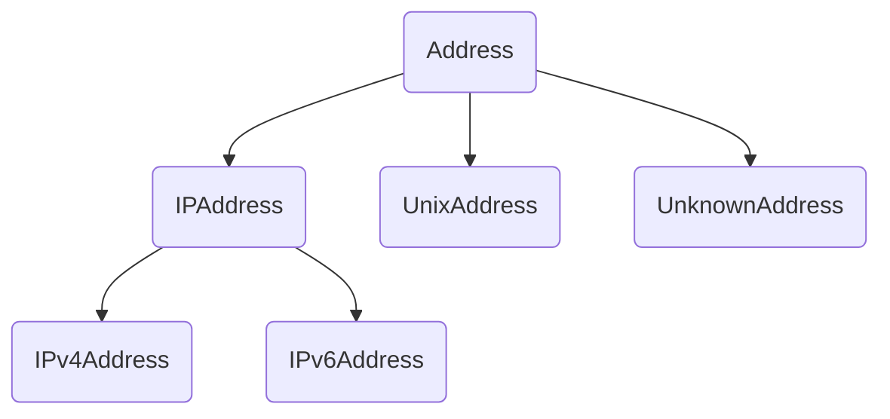

# 概述

- 提供网络地址相关的类，支持与网络地址相关的操作。
- IPv4 协议对应 IPv4 地址，长度是 32 位；IPv6 协议对应 IPv6 地址，长度是 128 位；Unix 域套接字地址是一个路径字符串。
- Berkeley 套接字接口拟定了一个通用套接字地址结构 sockaddr，用于表示任意类型的地址，所有的套接字 API 在传入地址参数时都只需要传入 sockaddr 类型，以保证接口的通用性。除通用地址结构 sockaddr 外，还有一系列表示具体的网络地址的结构，这些具体的网络地址结构用于用户赋值，但在使用时，都要转化成 sockaddr 的形式。
```C++
sockaddr表示通用套接字地址结构，其定义如下：
struct sockaddr
{
	unsigned short sa_family; // 地址族，也就是地址类型
	char sa_data[14];         // 地址内容
};
```
- 所有的套接字 API 都是以指针形式接收 sockaddr 参数，并且额外需要一个地址长度参数，这可以保证当 sockaddr 本身不足以容纳一个具体的地址时，可以通过指针取到全部的内容。
- 除 sockaddr 外，套接字接口还定义了一系列具体的网络地址结构，比如 sockaddr_in 表示 IPv4 地址，sockaddr_in6 表示 IPv6 地址，sockaddr_un 表示 Unix 域套接字地址，它们的定义如下：
```C++
struct sockaddr_in 
{
	unsigned short sin_family; // 地址族，IPv4的地址族为AF_INET
	unsigned short sin_port;   // 端口
	struct in_addr sin_addr;   // IP地址，IPv4的地址用一个32位整数来表示
	char sin_zero[8];          // 填充位，填零即可
};
	
struct sockaddr_in6
{
	unsigned short sin6_family; // 地址族，IPv6的地址族为AF_INET6
	in_port_t sin6_port;	   	// 端口
	uint32_t sin6_flowinfo;	    // IPv6流控信息
	struct in6_addr sin6_addr;	// IPv6地址，实际为一个128位的结构体
	uint32_t sin6_scope_id;	    // IPv6 scope-id
};
	
struct sockaddr_un
{
	unsigned short sun_family;  // 地址族，Unix域套字地址族为AF_UNIX
	char sun_path[108];         // 路径字符串
};
```


# Address

- 所有网络地址的基类，抽象类，对应 sockaddr 类型，但只包含抽象方法，不包含具体的成员。
- 除此外，Address 作为地址类还提供了网络地址查询（通过 getaddrinfo() 函数）及本机网卡地址查询功能（通过 getifaddrs() 函数），其中网络地址查询功能可以实现域名解析，网卡地址查询可以获取本机指定网卡的 IP 地址。


# IPAddress

- 继承自 Address。
- IP地址的基类，抽象类，在 Address 基类的基础上，增加了 IP 地址相关的端口以及广播地址、网段地址、子网掩码操作，但只包含抽象方法，不包含具体的成员。


# IPv4Address

- 继承自 IPAddress。
- IPv4 地址类，实体类，表示一个 IPv4 地址，对应 sockaddr_in 类型，包含一个 sockaddr_in 成员，可以操作该成员的网络地址和端口，以及获取广播地址、网段地址、子网掩码操作。


# IPv6Address

- 继承自 IPAddress。
- IPv6 地址类，实体类，表示一个 IPv6 地址，对应 sockaddr_in6 类型，包含一个 sockaddr_in6 成员，可以操作该成员的网络地址和端口，以及获取广播地址、网段地址、子网掩码操作。


# UnixAddress

- 继承自 Address。
- Unix 域套接字类，实体类，表示一个 Unix Socket 地址，对应 sockaddr_un 类型，包含一个 sockaddr_un 对象以及一个路径字符串长度。


# UnknownAddress

- 继承自 Address。
- 表示一个未知类型的套接字地址，实体类，对应 sockaddr 类型，该类与 Address 类的区别是它包含一个 sockaddr 成员，并且是一个实体类。


# 其他说明

- 注意大小端问题，sylar 封装了 byteswapOnLittleEndian() 等方法用于大小端转换。


# 关系图


